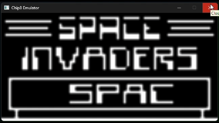
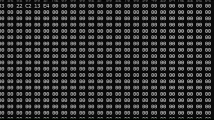
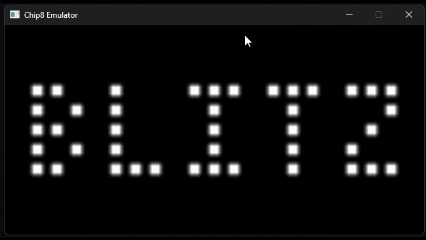
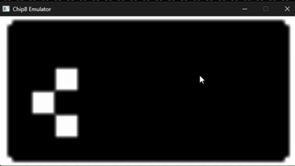
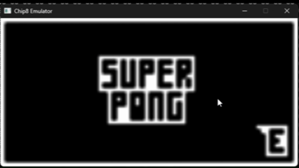
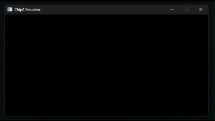
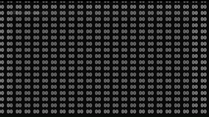

# CHIP-8 Emulator

A CHIP-8 emulator built in C that simulates a complete virtual machine, including CPU, memory, stack, timers, input handling, and display rendering.

This project demonstrates low-level system design, instruction decoding, and emulator architecture, similar to how real CPUs execute programs.


# Demo

 

**Brix**


<br>



**Space Invader**


<br>



**Outlaw**


<br>



**Blitz**


<br>

 

**SlipperySlop**


<br>



**SuperPong**


<br>

 

**Tank**


<br>



**Tetris**


# Features
- Full opcode interpreter (CHIP-8 instruction set)
- 4KB memory architecture
- 16 general-purpose registers (V0–VF)
- Index register (I), Program Counter (PC)
- Stack for subroutine handling
- Delay and Sound timers
- Sprite rendering (64x32 display)
- Collision detection (VF register)
- Hex keypad input handling
- ROM loading and execution

# Architecture

The emulator is structured into modular components:
```text
+------------------+
|      Memory      |
|     (4KB)        |
+------------------+
| Registers (V0-VF)|
+------------------+
|   Index (I)      |
| Program Counter  |
+------------------+
|      Stack       |
+------------------+
|  Opcode Decode   |
|   & Execute      |
+------------------+
|     Renderer     |
|    (64 x 32)     |
+------------------+
|      Input       |
|   (Keypad)       |
+------------------+
|     Timers       |
| (Delay / Sound)  |
+------------------+
```

# Key Components
- CPU → Fetches, decodes, executes instructions
- Memory → Stores program + fonts
- Display → Renders sprites
- Input → Maps keyboard to CHIP-8 keypad
- Timers → Handle delay and sound

# Instruction Execution Cycle

The emulator follows a classic Fetch–Decode–Execute loop:

1. Fetch
    - Read 2-byte opcode from memory using the Program Counter (PC)
2. Decode
    - Extract instruction components using bitwise operations
    - (e.g., 0x6XNN, 0xDXYN)
3. Execute
    - Perform operation:
    - Register updates
    - Memory access
    - Drawing sprites
    - Handling input
4. Update
    - Increment PC or jump
    - Update timers


# Example ROMs

For testing the Chip-8 Emulator, you can try execute the Test_Opcode ROM <br>
[test_opcode.ch8](test_opcode.ch8)

The emulator successfully runs classic CHIP-8 programs:

- Super Pong : [superpong.ch8](superpong.ch8)
- Tetris : [Tetris.ch8](Tetris.ch8)
- Slippery Slope : [slipperslope.ch8](slipperslope.ch8)
- OutLaw : [outlaw.ch8](outlaw.ch8)

Running real ROMs validates correctness of instruction handling and rendering.

# Tech Stack

Language: C <br>
Graphics/Input: SDL3


# How to Run
```bash
git clone thisrepo
cd chip8-emulator
./Emulator.exe path/to/rom
```

# Key Learnings
- Low-level system emulation and CPU design
- Instruction decoding using bitwise operations
- Memory and register management
- Real-time rendering with SDL2
- Event-driven input handling
- Debugging stateful systems


# Challenges
- Correct opcode implementation and quirks
- Synchronizing timers with execution cycle
- Accurate sprite rendering and collision detection
- Mapping keyboard input to CHIP-8 keypad